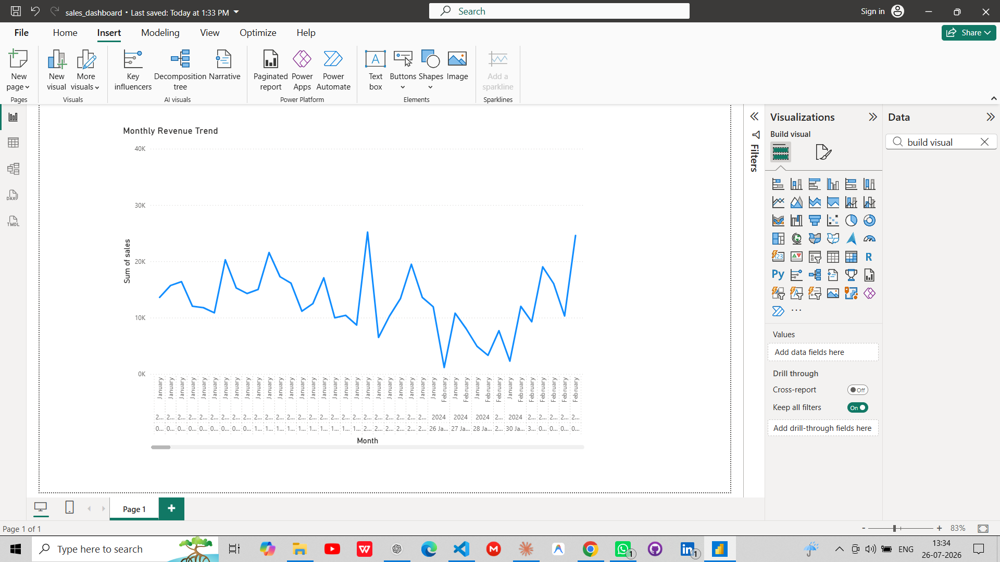
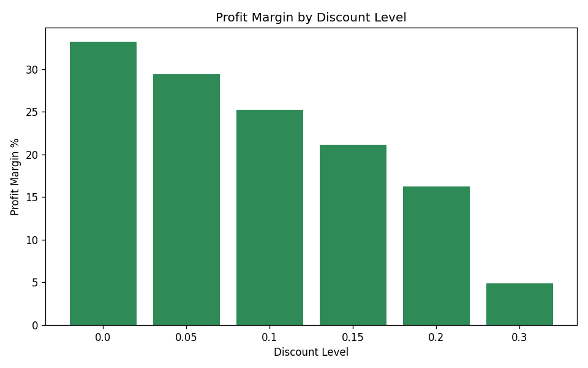
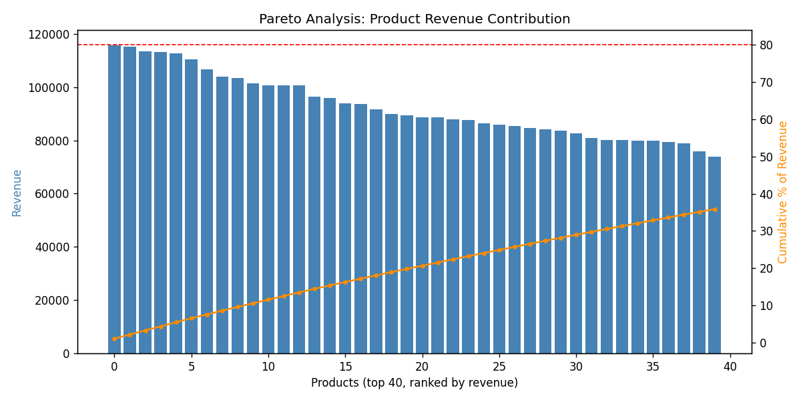
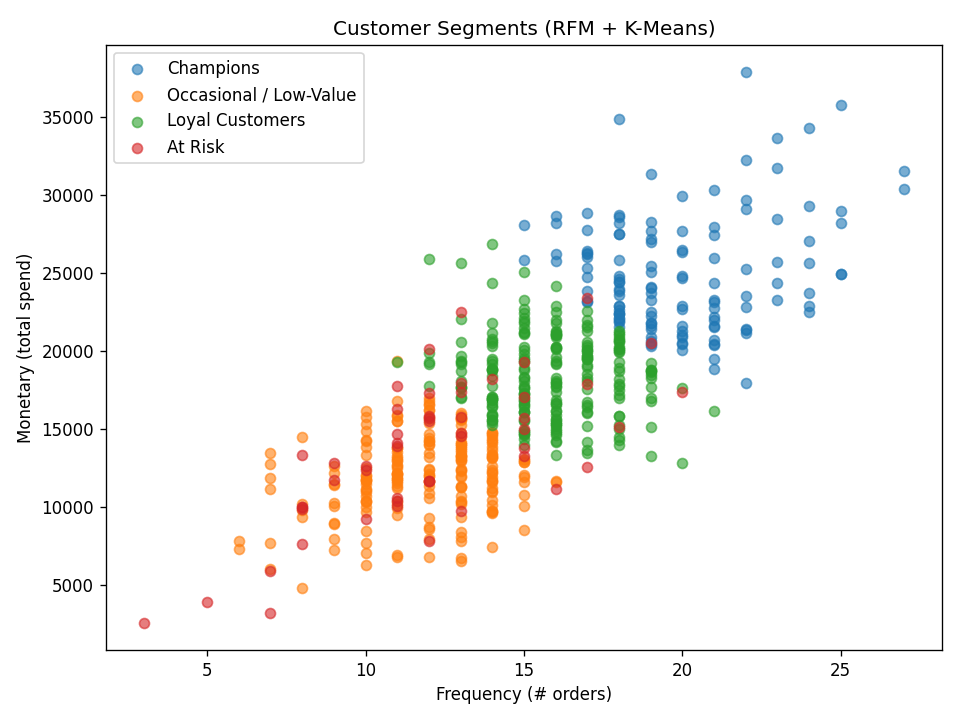
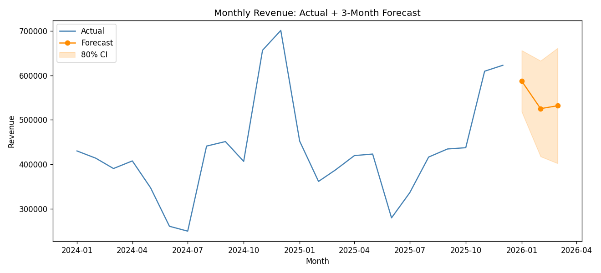
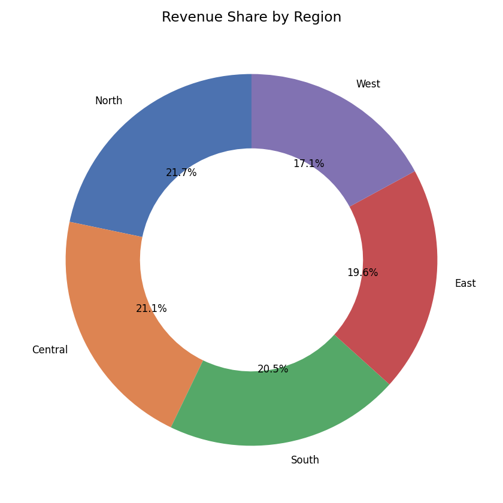
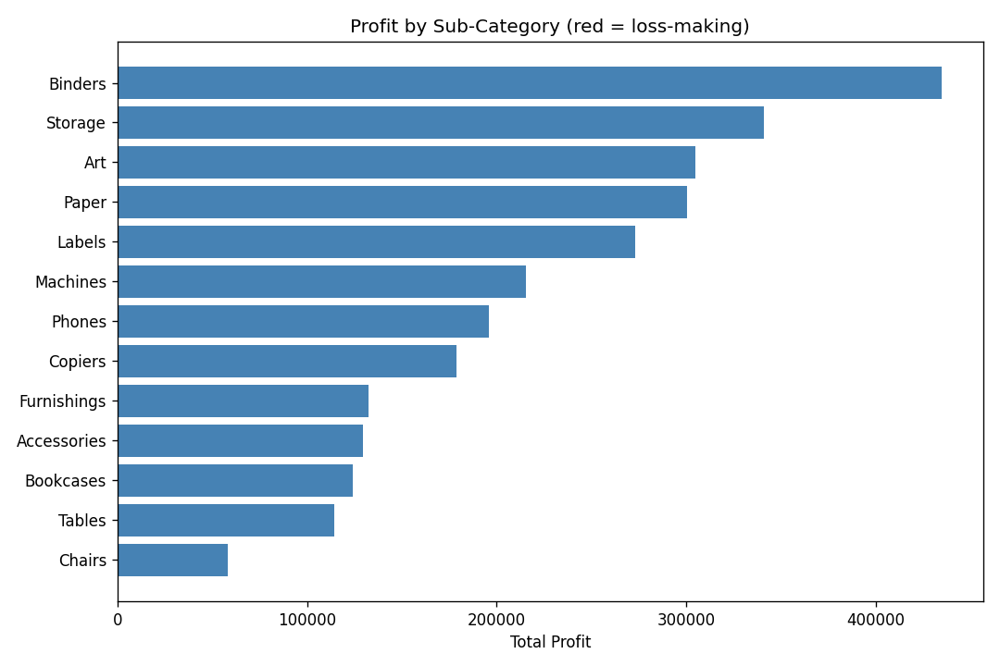

# End-to-End Sales Analytics Dashboard

SQL + Python + Power BI analysis on a Superstore-style transactional
dataset — covering KPI tracking, profit analysis, customer segmentation,
product performance, and revenue forecasting.

## Case Study

**Problem**: Build a full sales analytics pipeline from raw transactions to
decision-ready insights, covering the full BI stack — SQL for KPIs, Python
for statistical analysis, and Power BI for stakeholder-facing visuals.

**Approach**: Designed a star-schema data model (fact_sales + dim_customer +
dim_product) in PostgreSQL, wrote 10 KPI queries using window functions for
growth/ranking metrics, then layered Python (pandas, scikit-learn,
statsmodels) on top for customer segmentation, ABC analysis, and time-series
forecasting. Power BI ties it together as an interactive front-end.

**Key insight**: Discounting has a near-linear negative effect on margin —
33% margin at 0% discount collapses to under 5% at 30% discount. This kind
of finding is easy to miss in raw sales dashboards that only track revenue,
not margin-by-discount-tier.

**Tools**: PostgreSQL, Python (pandas, scikit-learn, statsmodels,
matplotlib), Power BI, Excel/Google Sheets.

## Dashboard


*Power BI dashboard — monthly revenue trend, built on a PostgreSQL-backed
star schema.*

## Key Findings

### 1. Discounting kills margin fast


Profit margin drops from 33.2% at no discount to 4.9% at 30% discount —
a near-linear relationship. Any blanket "30% off" promotion should be
reconsidered against this curve.

### 2. Revenue is concentrated (ABC / Pareto analysis)


~56% of products (Class A) drive ~80% of revenue — the remaining products
are candidates for repricing or discontinuation.

### 3. Customer segments (RFM + K-Means)


Clustered customers into Champions, Loyal, Occasional/Low-Value, and At
Risk using Recency-Frequency-Monetary features. The "At Risk" segment was
identified by high recency (haven't ordered in ~5 months) rather than low
spend alone — these customers used to be valuable and are worth a
re-engagement campaign.

### 4. Revenue forecast beats a naive baseline


An ARIMA model achieved 4.65% MAPE on a 3-month holdout, vs. 27.04% for a
simple 3-month moving-average baseline — always worth reporting this
comparison, not just the model's own accuracy in isolation.

### 5. Revenue by region


Fairly even geographic spread (17-22% per region), with North leading —
no single region is a critical dependency.

### 6. Sub-category profit breakdown


All sub-categories are profitable in this dataset, but margin varies
meaningfully (Chairs at 18% vs. Accessories at 35%) — useful for
prioritizing where to invest marketing spend.

## Project Structure

```
data/                       raw + derived CSVs, sales.db (SQLite for local testing)
sql/
  01_schema.sql               PostgreSQL star schema (DDL)
  02_kpi_queries.sql          10 KPI queries: growth, AOV, running totals, rankings
scripts/
  generate_data.py            synthetic dataset generator
  load_sqlite.py               loads CSVs into local SQLite
notebooks/
  customer_segmentation.py    RFM + K-Means clustering
  product_performance.py      ABC/Pareto analysis
  profit_analysis.py          discount-vs-margin, sub-category profit
  forecasting.py               ARIMA vs moving-average baseline
  region_revenue.py            revenue by region
excel/sales_summary.xlsx     raw data + pivot-ready summary sheets
powerbi/                      .pbix file
assets/                        chart images used in this README
```

## How to Run

```bash
pip install pandas numpy faker scikit-learn statsmodels matplotlib openpyxl

python scripts/generate_data.py
python scripts/load_sqlite.py
python notebooks/customer_segmentation.py
python notebooks/product_performance.py
python notebooks/profit_analysis.py
python notebooks/forecasting.py
python notebooks/region_revenue.py
```

For PostgreSQL: run `sql/01_schema.sql` against your own instance, then
`\copy` the three CSVs in (commands are in the schema file). All 10 queries
in `02_kpi_queries.sql` use PostgreSQL-native syntax (`to_char`, `EXTRACT`).

## Dataset

Synthetic but realistic — 600 customers, 220 products, 9,000 order line
items across 2024-2025, with seasonality (festive-season spike, mid-year
dip) and discount-driven margin effects. Generated in
`scripts/generate_data.py`; swap in the real Kaggle Superstore or Olist
dataset later — the schema mirrors those closely enough that every
technique here transfers directly.
